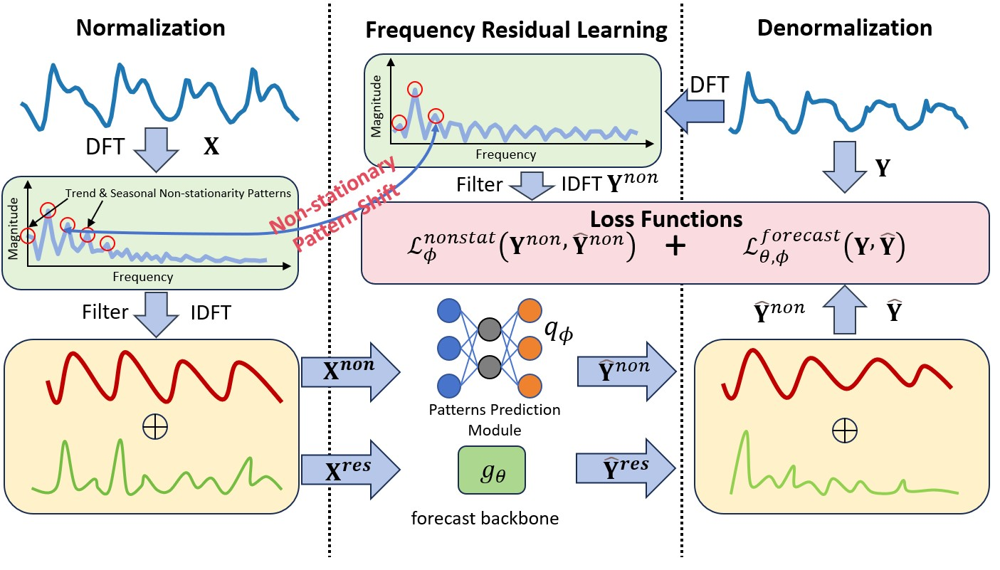

# 1 Frequency Adaptive Normalization For Non-stationary Time Series Forecasting

This is the offcial repository of paper "Frequency Adaptive Normalization For Non-stationary Time Series Forecasting"




# 2 Prepare Datasets

ETTh1, ETTh2, ETTm1, ETTm2, ExchangeRate, Weather, Electricity will be downloaded automatically

# 3 Run baseline&FAN

## 3.1 install requirements

1. to run our code, **Please make sure your python version is >=3.8.**
2. install all the requirements, we assume that you have installed torch according to your environment
```
pip install -r ./requirements.txt
```


## 3.2 run scripts

Please first source this init.sh script:

```
source ./init.sh 
```

or manually add this directory to your PATHONPATH environment variable

```
export PYTHONPATH=./
```

### 1. FAN

Please change the settings in the following for what you need.
```python
# running FAN using FEDformer backbone with output length 96, 168, 336, 720 on dataset Electricity Traffic with input window 96, and hyperparameter k = 4
./scripts/run_fan_wandb.sh "FEDformer" "FAN"  "Electricity Traffic " "96 168 336 720"  "cuda:0" 96  "{freq_topk:4}"
```
### 2. baselines
Please change the settings in the following for what you need.
```python
# running all baselines~(DLinear backbone) with output length 96, 168, 336, 720 on dataset ETTm1 ETTm2 with input window 96
./scripts/run.sh "DLinear" "No RevIN SAN DishTS" "ETTm1 ETTm2" "96 168 336 720"  "cuda:0" 96
```
